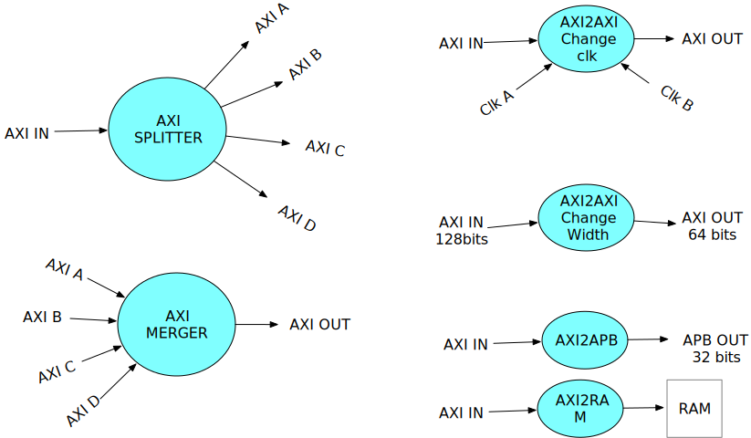
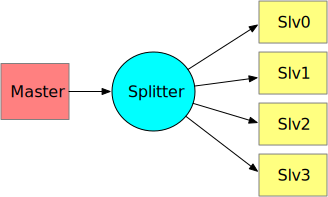
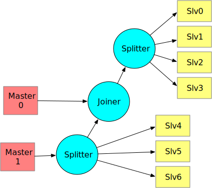
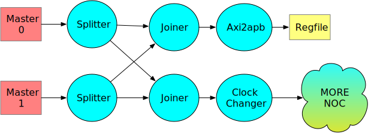
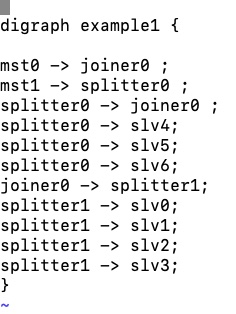

# AXI based NOC 
I got frustrated with existing NOC solutions, so why not try my own?

## why NOC?
In almost every ASIC, there is region called SOC. System On a Chip. It is a collection of modules that should work together. 
Usual ingredients are CPUs, DMAs, Accelerators, Register files, Communication modules, Off-chip memory controllers, 
On-chip memories  Rams, Roms, Flash embedded, Security and more that now i forgot.
To make them into a coherent system, conventional way is to hang them all on a NOC. Network on a chip.

At Virata, years ago, we created ring based NOC, that didn't have masters and slaves and was passing messages at 
pretty high speed between all members. Instead of Masters and Slaves, all members of the system were sitting in a few circles, passing messages around, until it hit the addressee. (More can be found in my gitHub)

Sweet memories..., but nowadays all ingredients have AXI, AHB or APB interfaces (and couple more weirder ones).

## Choices
There used to be 3 vendors + ARM + selling NOC creators. They come with fancy configuration app.
I say "used to" because they are being swallowed and not sure to exist on the market much longer.
All apps create ugly unreadable RTL code. My guess it is on purpose to make it look sophisticated and 
hard to implement Yourself. 

There is also open-source (like OpenSoC) but for me it has  "מרובה תפסת , לא תפסת " syndrom. If Your Hebrew is lacking  - it approximately translates to " there is no value in excess". 

My rings-inspired NOC is still great, but it is scary to conventional designers and their managers. 
This is the reason i thought of AXI NOC from scratch. 
Recently,  projects i came across in companies i work for, could benefit from simple NOC that 
doesn't require a dedicated person cooking the ( Arteris Sonics netSpeed )  for the duration of the project and beyond. About hardships of these commercial solutions You can read in my older Linky-Dinky post.  And anyway,  most of them are not that relevant or alive.

## The setup of AXI NOC

Suppose You have few AXI4 masters and bunch of slaves. 
The task is to enable masters to access slaves with max reasonable efficiency.
Complications and restrictions:

1. The slaves might have APB or AXI interfaces.
2. We should support several clock regions.
3. For first viable, the AXI is 64 bits data and 32bits address.  
4. Not all Masters can access all Slaves. There should be easy way to configure that too.
5. AXI in standard has 4 busses without nebulous  job, that 90% of designs don't know what to do with them: size, prot, cache and qos. In this design, instead, i allocate "extras" bus with configurable width. Do with it whatever. Size will probably creep back in.
6. Cut combi paths into manageable timing pieces, layout friendly, Latency of clock here and clock there is not a problem. 
7. QOS is for losers.
8. Keep it simple, focused. Debuggable. Humanly understanble.  I dont expect it to save the world or make coffee. My cat can do that.

## The idea
We define and implement a limited set of building blocks. Out of this limited set we can compose any NOC we need.

 For the first version there are only six modules:

1. splitter module has one incoming AXI port and up to four outgoing. Each incoming burst is routed to approprite out port.
2. merger module has up to four incoming ports and single outgoing port.
3. clock changer module is inserted between two different clock domains.
4. axi2ram module is demo module to connect ram to this noc.
5. axi2apb module is translation to apb slaves.
6. (planned) change AXI width module. e.g. from 128 to 64 and back. Keep in mind, that AXI is two way street. Modules have to keep tabs on what going through the in order to route response correctly back. All modules introduce a clock delay between ports.
7. (planned) SERDES. Optimizing serializer of the traffic. Full AXI is handful bunch of wires. The traffix can be made thinner busses.

##  Connecting the dots
Here is an example of simplest master and 4 slaves

Here is example of non-symmetric network.

Example of APB and ClockChanger.

##  Let's build the dot
I like graphviz and use "dot" language to make documentation and in this case also  to describe a design.
The advantage is a simple input language and instant visualization. No special tricks. 
No tedious graphic application.
Modest python script reads the "dot" source and creates a real RTL module. 
It also creates "verilog instance" text to use in chip integration. 
And stand alone python test-bench (planned).

The RTL module of NOC is a straightforward mapping of the source file, keeping the names and thus facilitating
easy debug and verification.

Here an example of dot code (source of the non-symmetric example)

Here is the graph representation by "dot" compiler:

The RTL created is too long for document, Examples (runnable!) can be found in my gitHub vlsistuff.

## Addressing. Important and tricky.
Usually NOC route traffic based on transaction address.   
The steering of the writes and reads is based on pre compiled address tables.
We do the opposite.
Merger modules don't have any address sensitivity. Only splitter modules must decide which output port to use.
The simple solution:  take two msb bits of address and use them as index to decide where to send the transaction. On selected downstream port the address is  shifted two bits left. So the next decision point have fresh two bits.
The software in masters, should be aware of this shifting, and configuration script, adds "shift value" for each slave. This number is used by connection to slave to shift the address back. If the slave is 3 layers from master, it will receive address shifted six bits right. RTL creator auto-adjusts the address back for each slave.

CPU software gets a table of addresses for each slave,  adapted for each master CPU. In all NOCs it is pretty much the same.
If this addressing will be too confusing, we may switch back to more conservative table based traffic steering.

## What is the status
in my github, clone:  https://github.com/greenblat/vlsistuff.git
there is directory called axi_noc. All is  there.  Including building block RTLs and few demos. The demos cover major verification issues. Biggest NOC simulated was 16 masters over 16 slaves. While it can be configured much bigger (and work ok) , I feel for a larger network -  a modified solution may be needed.

## What's next?
- One of the advantages and key features of ring based (no masters nor slaves, but all modules can listen and talk) was it's totality - meaning ALL interaction of any module with SOC was through the NOC. No out of band and no dedicated interrupt wires. All messaging between servers and clients was done by NOC.
  In my AXI NOC we may utilize the READ channel of AXI to convey messages from slaves back to masters.  Thus replacing ad-hoc interrupt contraptions.

- Another painful aspect is error reporting. In AXI, errors (bresp and rresp) come back to a hapless master. Usually there is no idea what to do with them. In best case, it just raises interrupt.
  In RINGS, All errors arrived to a predefined  master, called the ANCHOR.  There was one place to deal with system errors. The error messages arrived at fifo attached to the ANCHOR and it could deal with them at it's own pace. Similar idea is good to implement here.

- Adding SER-DES option.  Serialize AXI bus to any requested wire width and reconstruct it on the other end..

- Adding Safety features:

1. Policeman. Keeping traffic legal.
2. ECC options. Not trivial
3. Encryption / Decryption on critical links
4. Breaker of long bursts into small bursts (to make fairness easy)

## What's missing

2. Some modules are in development stage and are empty in GIT:  clock and width changers.
3. Internal verification covers most of it. Working on external verification (by external party).
4. Not going to add AHB interfaces. You probably have them already. If not, good for You.
5. Not going to build it in VHDL. Enough weapons as it is.

## Issues and Objections (thanks to Rony)

As with any new idea, there are level one objects and issues. Here is the first batch (feel free to raise more)

1. Compliance to AXI.   Answer: Verification.  And keep in mind, commercial solutions also have bugs. Especially when You configure them.   The extra bonus You get using Arteris/Sonics/netspeed/Others:  someone to blame.  Hefty price to pay.

2. Do you provide a custom model to simulate high level behavior?

   QOS is for losers. Do You do something with that, other than finding hapless junior to play with it?

3. Timing closure 

   Serious issue. All "LEGO" bricks cut combi paths. Either inputs or outputs of all modules are flops. Memories are not part of the project. Synchronizers dont cause timing problems. 

4. Several NOCs in one chip

    All axiNoc interfaces are AXI. So no problem connecting several "pages" together.  If another NOC is present - same AXI connection.

5. Custom features : ECC, Firewalls and setera.

   The idea is to integrate them in the package. Eventually.

6. DFT?

   what about it? What help other vendors provide?

7. Risk in using new axiNoc.

   Every ASIC endevour has high risks. Using easy to verify and debug axiNoc doesn't contribute significantly to risk, but usually reduces duration. Using commercial solutions carries same risk because of complexity of configuration and opaquiness of the resulting RTL.

8. Industry standards.

   Love this one. Accelera standards usually stink. The reason they are so popular is because they are popular and  clueless management  buys into them.
   
   
   
## So what can You do now?

   Clone the repository. Look at the RTL code. Look at examples. Prepare Your own.  

Simulate it with Your tools or use open source like me.
Report insights, ideas, problems and concerns. Save bunch of money and effort by ditching expensive alternatives.  As with any (open-source  or not ) project  - problems will surface. But nothing like a showstopper and the axi_noc design is ready to be taken from the shelf. 

greenblat@me.com

22oct2021:  Added axi_slice.v . Jst path breaker for long wires. Adds one clock delay. Similar axi2clock.v which can also change the clock.

