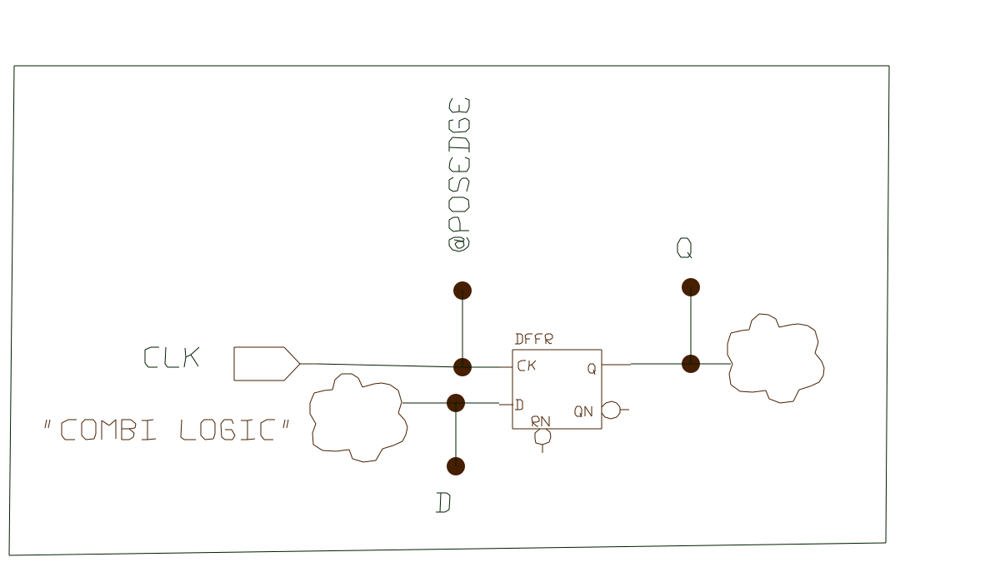
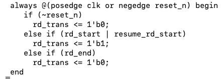
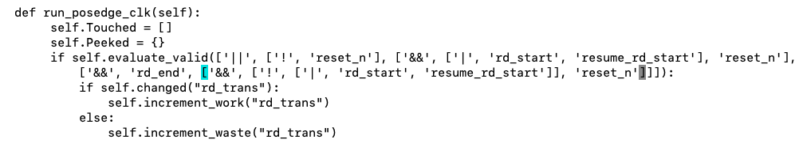
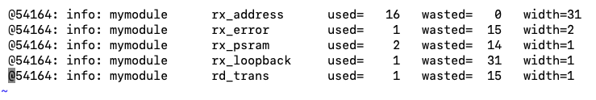
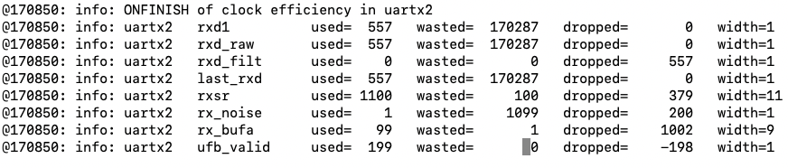

# Clock Efficiency flow

## What is Clock Efficiency
Each flop in an ASIC chip has a clock input. Usually this clock is a leaf of a clock tree (or one of the trees).
On edge (+ or -), this flop samples the data input "D" and transfers the new value to output "Q". If "D" causes a change in the "Q" it is a usefull clock cycle.
For some clock events, the new data "D" is different from previous "Q".  For others, they are equivalent and nothing happens.

Efficiency is defined the ratio between "usefull" clocks and total number of clocks reaching the flop.
Most new designs have elaborate clock gating. If the clock tree is disabled early or in many branches, we save power.
Clocktree power consumption is relatilvely significant, and to save battery, It is desirable to increase the ratio.
The way to do it, is rewrite RTL, so more flops will have enables.

Another angle is number of "D" changes, when there is no clock. It means we waste energy toggling the "D" without using it.

## The game is saving power.
For washing machine chips, this is not a big deal, as the red light in front of the machine consumes more power than all electronics. But for batterie powered devices or energy harvested from environment this could be a big deal.

## How
There are severl ways to get info on wasted clock cycles,  It can be done on gatelevel, where for every flop, we assign python monitor (generated by script).
This monitor catches the edge of the clock, peeks at "D" and compares to "Q". (Clock going up in simulation, preceeds the change of Q). Note that to save power, CLK can be actually a gated clock. So environment counts the number of clock edges against difference of "D" and "Q".  Ideally these two counts should be equal. In reality, we can try to rewrite RTL to increase the ratio.

For rtl, script described below creates class that monitors one module (or deep into one module), gathers the counts and reports in the end. The script collects all "always" with Clocks qualified with "pos or neg edges" and all left side variables of "Qflop <= ".  We also count the number of times "D" toggles and there is no clock. 

The result is written into Python class that counts the same scenarios.
The whole flow is supported by Python-Driven-Verification.

Third option, is to use same python class as before, but run it on VCD file from simulation using vcd_python3 executable.

## Preparation

pyver.py rtl/my_module.v -do clock_efficiency_rtl 
(pyver.py and clock_efficiency_rtl.py are in gitHub repository vlsistuff/verpy/pybin)
this should create a file my_module_efficience.py

## Simulation  (requires pythnon-driven-verification from the same git)
xrun/vcs/iverilog -f **YourFileList** .......

at the end of the test, report is printed out  into  pymon.log0

## how it really looks

RTL code:

 Using pyver.py system with clock_efficiency.py driver, Will create the following code:   

Not shown is the class definitions and other counters. Also some optimization can reduce the complexity of this expression.

Running any simulation with this class imported and constructed, will yield report something like :

another example of log file, with DROPPED enabled. Notice, negative dropped values, it happens when the new data coming from  literal values.

Width of the flop registers is important here, because it multplies the effect. The so first line is very good, while others are not and need to be examined for opprtunity to improve power consumption. The sum of "used" and "wasted" counters is the number the clock of these flops was toggled.

With this new info, we can scan the RTL and try to improve ratios of the worst offenders.

### work in progress

The question is how efficient is this flow to improve power consumption. I am doing few trials and results are updated in **vlsistuff/clock_efficiency**    . This doc is in **vlsistuff/docs**

