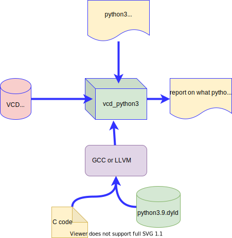

# Vcd_python3

vcd_python is a compiled "C" program that scans VCD file and can call python routines.
Python code is usually called on any clock posedge or negedge and it can probe any net value in the hierarchy. 

Complex patterns in VCD files can be easily found this way. Python has a long memory.

## Vcd_python32

The new version of vcd_python is called vcd_python32 and it has additional feature to produce annotated VCD file.

To accomplish annotation, vcd_python32 adds  force(Path,Value) routine. It can change any existing net value, but more importantly and usefull, it can modify value of any of couple of dozen artificial (added) busses. This makes it easy to correlate what python code prints out (like errors in original simulation) with what You see in the waves.

The output VCD file is called **traced.vcd**. Gtkwave is an excellent app to view the waveforms. 

Vcd_python32 is free and downloadable from my GitHub repository (called vlsistuff with user name greenblat). It requires GCC or LLVM and some Linux/OS X hands-on experience on Your side.  You are welcome to ask me for help to compile and use it or suggestions to improve it.

Thanks, Ilia greenblat@mac.com

